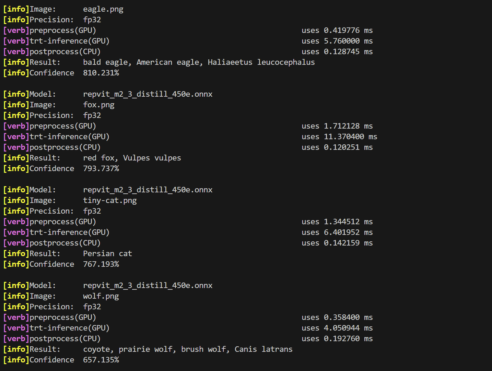

# RepViT TensorRT Deployment

This project primarily implements the TensorRT deployment of the [RepViT](https://github.com/THU-MIG/RepViT) model, including exporting PyTorch weight files to ONNX format and providing C++ inference code based on TensorRT.

## Project Structure

- `exportONNX/`: Python code used to export PyTorch weight files to ONNX format.
- `TRT_infer/`: TensorRT inference code written in C++.

## Dependencies

- **Frameworks and Libraries**:
  - PyTorch
  - ONNX
  - TensorRT
  - OpenCV (for image processing)

## Usage

### 1. Export ONNX Model

Navigate to the `exportONNX/` directory and run the following command:

```bash
-rw-r--r-- 1 fengzhe fengzhe     1426 Dec  5 18:47 export_onnx.py
drwxr-xr-x 3 fengzhe fengzhe     4096 Dec  5 17:06 model/
drwxr-xr-x 2 fengzhe fengzhe     4096 Dec  5 18:19 onnx/
-rw-rw-r-- 1 fengzhe fengzhe 95860931 Dec  5 16:01 repvit_m2_3_distill_450e.pth
------------------------------------------------------------------------------
python export_onnx.py 
```
then you can get onnx model and put it in `TRT_infer/models/onnx/`

### 2. Build TensorRT Inference Code

Navigate to the `TRT_infer/` directory and execute:

```bash
make run
```

### 3. Run Inference

In the `TRT_infer/build/` directory, run:

```bash
./bin/trt_infer 
```


## Acknowledgements

- Special thanks to the [RepViT](https://github.com/THU-MIG/RepViT) project for their open-source contribution.
- The TensorRT inference framework in this project is mainly inspired by [tensorrt_starter](https://github.com/kalfazed/tensorrt_starter). I express my gratitude.


